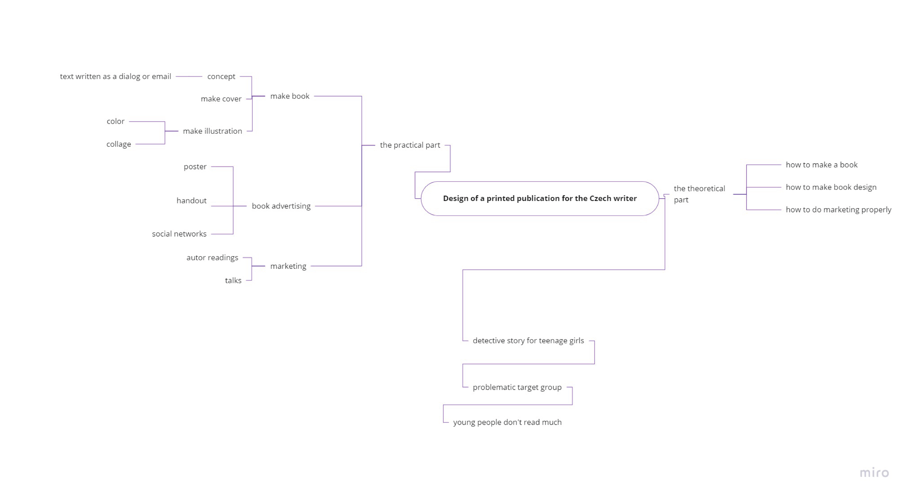

# Design of a printed publication for the Czech writer
This bachelor's thesis takes the form of a project, the aim of which is to create a prototype book for the Czech potential market from the author's text. The prototype of the book was processed on the basis of the rules of graphic design, including the marketing plan and promotion.

  
Mind Map

  

# Voice and tone
Voice:  confident and inspirational.

Tone: Formal (academic), but friendly.

# Outline
1. A detective story for young people, written with humor
2. The book prototype will be illustrated in the style of a photo collage
3. It will be a series of stories, edition of books
4. Improve fan communication with the writer, web design
5. Promotion of the book with the help of social networks, press materials, meetings with the author
6. In theoretical part of thesis I will write about book making, how to choose book format and typography, book cover design

# Notes

Project

Prototype book

Book making

A detective story

Photo collage

Marketing

Web design

# Keywords

Edition of books

A detective story

Illustration

Cover design

Promotion

# References
https://pop-pap.cz/obchod/

http://www.zlatastuha.cz/cs/archiv#cat3
