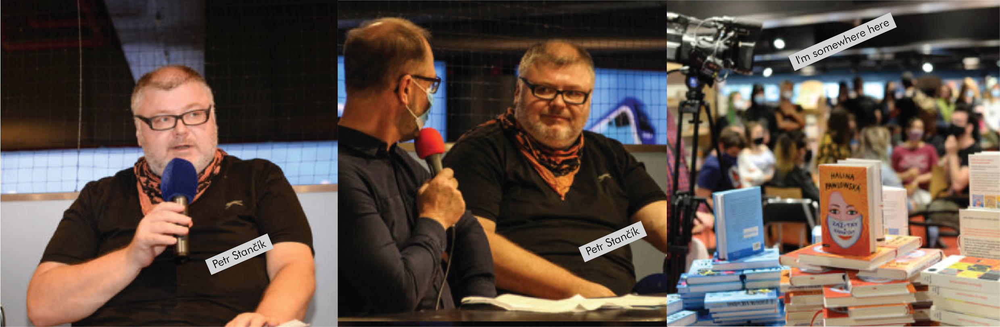

# Book design

This bachelor’s thesis investigates the aesthetics and process of book design and the promotion of readership to a younger audience and culture through a detective story about a young girl who experiences cyberbullying, written by the well-known Czech children and adult book author Petr Stančík.

The theoretical part deals with the individual procedures of graphic editing of books, which include layout, illustrations, typography and typesetting, cover and binding. Furthermore, this part contains an analysis of the market and target groups and an introduction to book marketing. Following the theoretical part, the practical part, which is the project itself, follows. The text provided for visual editing is a detective story about the main heroine Amonita and touches on the topics of cyberbullying on the Internet, the anonymity of users on social networks and the current problems of the young teenage generation. It is written in an unusual form of e-mail dialogue. The basic effort in the visual realization itself was to combine the text with its visual form into a balanced and at the same time attractive unit for the target group. The target group is specific, as it is mainly young people aged between 13 and 15, who are generally less interested in reading books, which was reflected in the final form of processing. A marketing strategy was created for this prototype, which consisted of involving social networks and creating advertising.

Keywords: Petr Stančík, author manuscript, children books, detective stories, cyberbullying, book design, book publishing, book promotion

# How I chose a topic for my bachelor's thesis
      
I knew from the beginning that I wanted to draw illustrations. But I didn't have a specific text or genre of the book selected. The Reading on the Train Festival helped me find a real writer. I just went up to the writer at the festival and asked him if he didn’t mind giving me his unpublished text and he agreed. It was a surprise for me that such a famous writer and so easily agreed to help me. Miracles happen.

# A detective story

As we agreed, I received a small text that was written in the form of emails. The text provided contains a detective story for teenage girls with a touch of humor. The main plot in the book revolves around Amonita, she is an introvert. The story of the main character touches on the topic of cyberbullying on the Internet, the anonymity of users on social networks and the current problems of the young generation. The title of the book and the short story is "Pogo of angels at the tip of a needle", which symbolizes the risky behavior of young people, a kind of walking on thin ice.

# Inspiration first

I was mainly inspired by Lois van Baarle. She is a digital artist and character designer from Netherlands, mostly used purple in the illustrations and it looks like new and modern drawing technique. The main character she draws is a girl it inspired me, because in the book that I make, the main heroine is a young girl. When I was thinking about which drawing technique to choose, I noticed that the combination of real photography with vector graphics or a collage is very popular on social networks. In the end, I tried to combine photo and vector, which allowed me to create authorial illustrations.

# Work in process
The hardest part is starting to draw, because the first illustration determines what the other pages will look like. During the creation of the first illustration, I rehearsed as the main heroine will look. Whether her face will be hidden or revealed on the first page. In the end, we chose the last variant.

# Illustration 
To illustrate the story, I chose a mixed style of photo collage and vector graphics. This mix of techniques also connects the main point in the book that the real world and contemporary life have largely moved into the virtual world and people live in a similar way as in a fictional world. Typography in typesetting is supported by emoticons that suggest and illustrate the narrator's mood. The beginning of each e-mail is taken into account in the text for better orientation in the text, and the avatar next to each e-mail also helps to visually distinguish the main characters in the book. I chose four main illustrations for the example, because there are 12 of them in total. I blurred the text because I gave my consent to non-proliferation.

# Book cover
The cover of the book depicts the shadow of the main character, on whom she cries with emoticons, which symbolizes cyberbullying. As you can see in the picture, the cover had many variants, it took a long time to choose the font and background and other details.

The cover was originally yellow-blue because the writer liked this choice of color. But after all the illustrations were drawn, the color changed to purple. At the moment this is the final version.

# Edition

The story doesn't end with one book, so I designed other covers for a possible continuation of the story of Ammonita.

# Feedback

# Conclusion

Working with Petr Stančík enriched me by reading quality literature, finding new authors for young adult literature. An important step will be the presentation of the book Pogo of Angels on the Tip of a Needle for the Euromedia publishing house. I believe that this book, if published, will gain its readers.

## List of used sources

1.	BHASKARANOVÁ, Lakshmi. Design Publikací. Praha: Slovart, 2007.

2.	PECINA, Martin. Knihy a typografie. Brno: Host, 2017.

3.	PISTORIUS, Vladimír. Jak se dělá kniha. Příručka pro nakladatele. Čtvrté, aktualizované vydání. Příbram: Pistorius & Olšanská, 2019.

4.	AMBROSE, Gavin, HARRIS Paul. Layout. Velký průvodce grafickou úpravou. Brno: Computer Press, 2009.

5.	SAMARA, Timothy. Grafický design. Základní pravidla a způsoby jejich porušování. Praha: Slovart, 2016.

## Facebook Petr Stančík

https://www.facebook.com/profile.php?id=100010666952975

